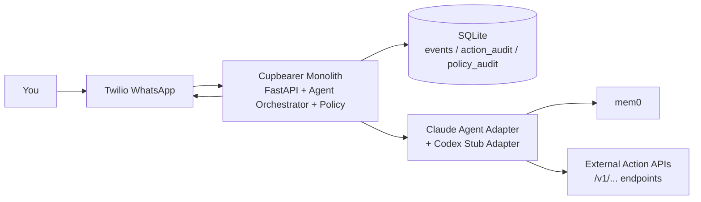
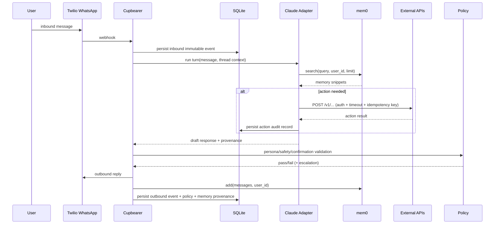

# Cupbearer v1 Architecture (Agent Layer Only)

## 1) System Diagram

## 2) Request Flow

## 3) Responsibilities Boundary

### Cupbearer Owns
- Message transport orchestration (Twilio WhatsApp webhook/send).
- Agent turn orchestration and provider adapter selection.
- Persona/safety/confirmation policy enforcement.
- Event/audit persistence and idempotency handling.
- Endpoint tool calling with auth/timeout/retry/idempotency mechanics.

### External Services Own
- Business-task execution logic behind `/v1/...` endpoints.
- Side effects in downstream systems (notes/reminders/etc.).
- Domain-specific workflow complexity.

## 4) Policy and Personality Enforcement

1. Mandatory outbound gate:
   - Tone: business casual, witty/playful where appropriate, concise, results-driven.
   - Safety: block or ask confirmation for high-impact actions.
   - Actionability: ensure user request is actually addressed.
2. Single send path: no bypass route around policy checks.
3. Policy decision stored with every outbound event.

## 5) Data Model (Minimal)

1. `events`
   - immutable inbound/outbound records
   - channel metadata + idempotency keys
2. `action_audit`
   - endpoint called, request hash, latency, status, retries
3. `policy_audit`
   - policy pass/fail, reason codes, confirmation state
4. `memory_provenance`
   - memory IDs/snippets injected for response generation

## 6) Risks and Controls

1. Risk: personality drifts under tool-heavy turns.
   - Control: policy validator scores style and rewrites/escalates on fail.
2. Risk: duplicate webhooks create duplicate actions.
   - Control: strict idempotency keys on ingest and outbound action calls.
3. Risk: Cupbearer bloats into workflow engine.
   - Control: hard rule that task logic remains in external endpoint services.
4. Risk: model lock-in.
   - Control: adapter interface with Claude default and Codex stub path.

## 7) MVP Acceptance Checks

1. WhatsApp inbound message yields stable outbound reply via one agent loop.
2. Endpoint action call path works and is fully audited.
3. Duplicate webhook replay does not duplicate side effects.
4. Every outbound message has policy decision + source event trace.
5. Memory retrieval/injection provenance is persisted.
